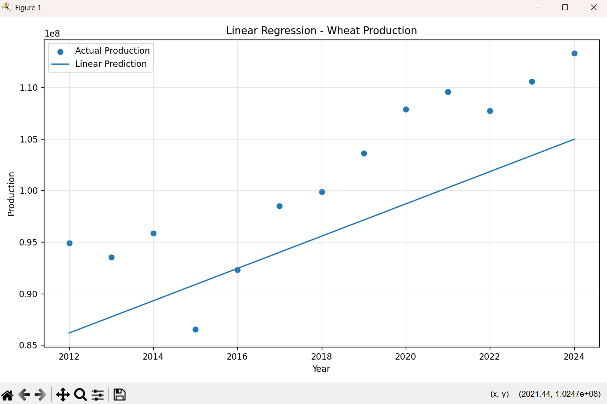
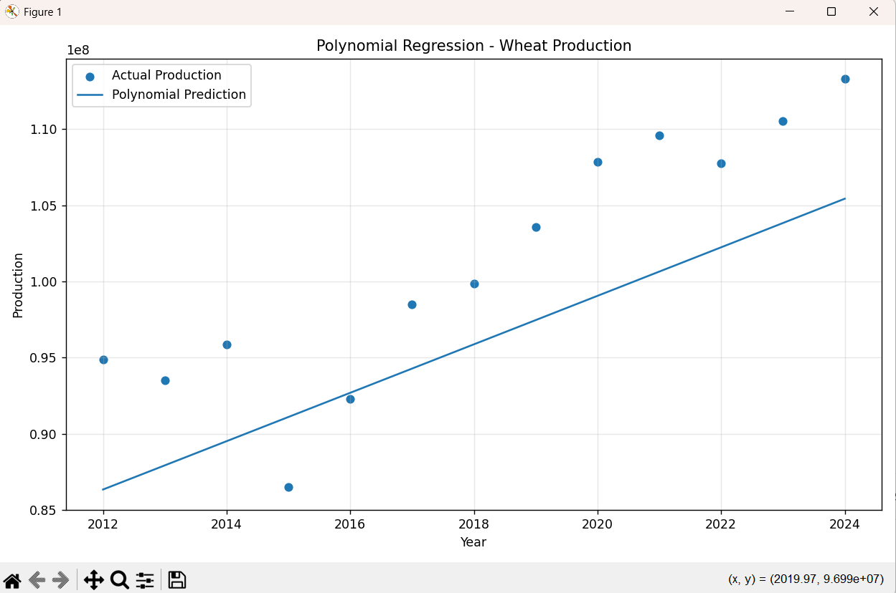
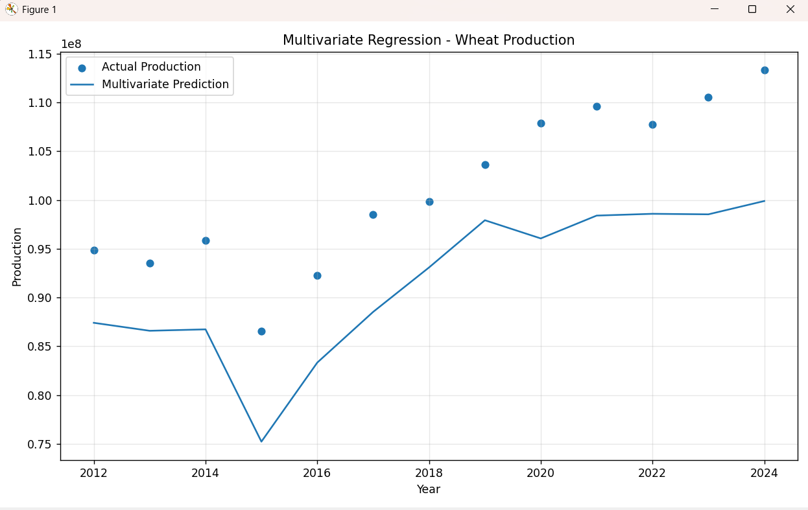
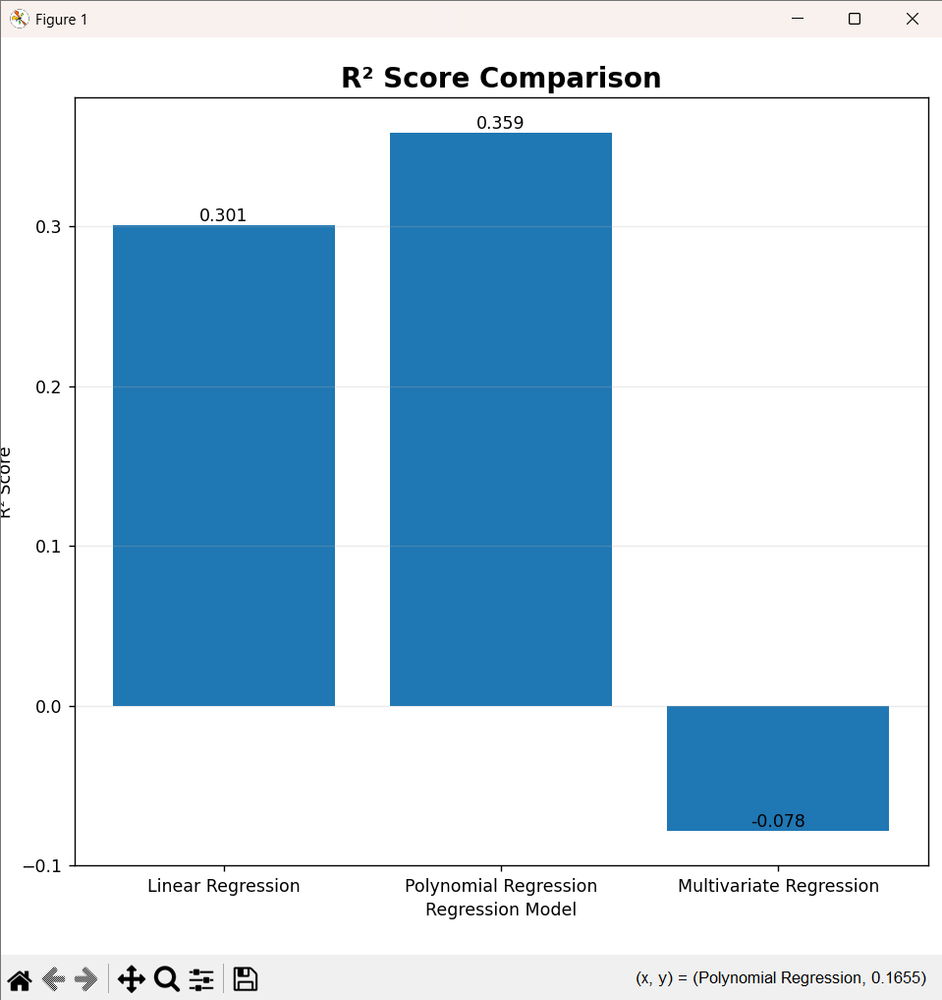
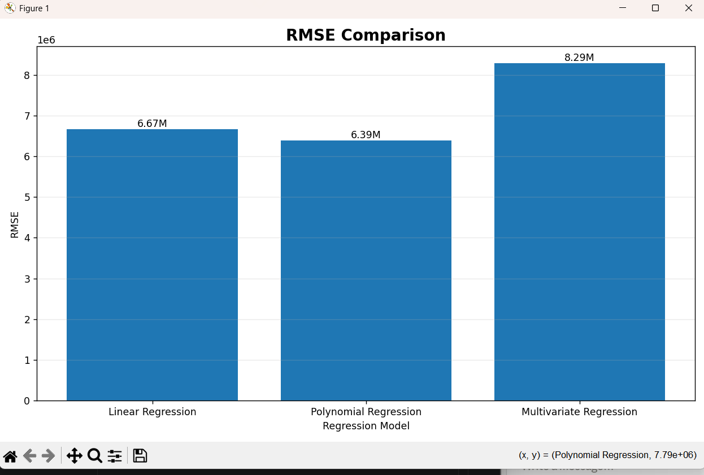
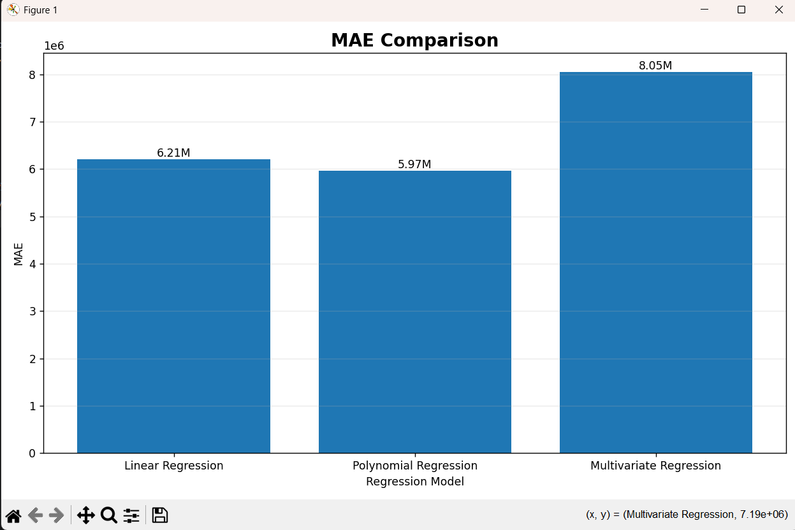
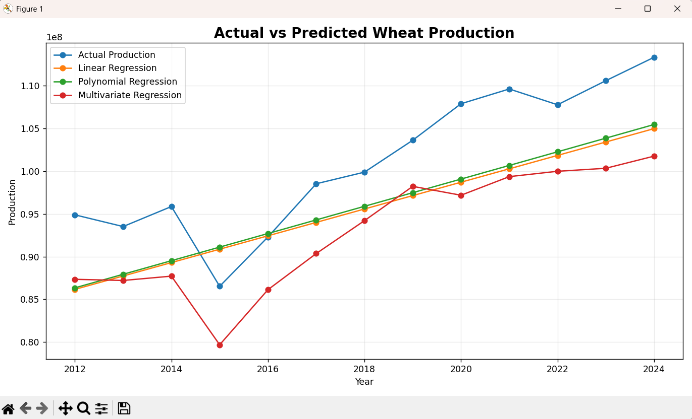

#  Wheat Production Prediction Using Regression (India)

##  Project Overview

This project uses **Machine Learning Regression techniques** to analyze historical **wheat production data** of **India**, obtained from **FAOSTAT (Food and Agriculture Organization of the United Nations)**.

The project builds and compares **three regression models** to predict wheat `Production` using historical agricultural data:

1. **Linear Regression** (`linear.py`)
2. **Polynomial Regression** (`polynomial.py`)
3. **Multivariate Linear Regression** (`multivariate.py`)

A fourth script, `comparision.py`, runs all three models together and generates a **side-by-side comparison** with metrics tables and graphs.

The models are trained on **80% of the historical data** and tested on the remaining **20%** (chronological split, since this is a time-series problem).

---

##  Objectives

- Load and clean historical wheat data from FAOSTAT.
- Reshape the data (pivot `Area harvested`, `Yield`, `Production` into columns per year).
- Split the dataset into **80% training** and **20% testing** data (chronologically, not randomly).
- Build three regression models:
  - Simple Linear Regression (`Year → Production`)
  - Polynomial Regression, degree 2 (`Year → Production`)
  - Multivariate Linear Regression (`Year, Area Harvested, Yield → Production`)
- Evaluate and compare model performance using:
  - Mean Squared Error (**MSE**)
  - Root Mean Squared Error (**RMSE**)
  - Mean Absolute Error (**MAE**)
  - R² Score
- Visualize actual vs predicted production for each model.
- Identify the best-performing regression model based on R² and RMSE.

---

##  Dataset

The dataset (`FAOSTAT1.csv`) was obtained from **FAOSTAT**.

- **Country:** India
- **Crop:** Wheat
- **Period:** 1961 – 2024
- **Total Observations:** 64 years

### Features Used

| Feature | Description | Unit |
|---|---|---|
| Year | Year of observation | — |
| Area Harvested | Total area harvested | ha |
| Yield | Crop yield | kg/ha |
| Production | Total crop production (target variable) | t |

### Train-Test Split

| Dataset | Observations (approx.) | Split |
|---|---:|---|
| Training | ~51 years | 80% |
| Testing | ~13 years | 20% |

The data is split **chronologically** (not randomly) since this is a time-based prediction problem — the model is trained on earlier years and tested on the most recent years.

---

##  Project Structure

```text
├── FAOSTAT1.csv        # Raw dataset from FAOSTAT
├── linear.py            # Simple Linear Regression (Year → Production)
├── polynomial.py        # Polynomial Regression, degree 2 (Year → Production)
├── multivariate.py      # Multivariate Regression (Year, Area, Yield → Production)
├── comparision.py       # Runs all 3 models and compares them
└── README.md            # Project documentation
```

---

#  Machine Learning Models

## 1️ Linear Regression (`linear.py`)

Models the relationship between `Year` and wheat `Production`.

```text
Production = m × Year + c
```

## 2️ Polynomial Regression (`polynomial.py`)

Uses `PolynomialFeatures(degree=2)` on `Year` to capture non-linear growth trends in production over time.

```text
Production = a₀ + a₁×Year + a₂×Year²
```

## 3️ Multivariate Linear Regression (`multivariate.py`)

Uses three input features — `Year`, `Area Harvested`, and `Yield` — to predict `Production`.

```text
Production = c + b₁×Year + b₂×Area_Harvested + b₃×Yield
```

##  Model Comparison (`comparision.py`)

Runs all three models on the same train/test split and prints comparison tables (MSE, RMSE, MAE, R²) along with graphs:

- R² Score Comparison (bar chart)
- RMSE Comparison (bar chart)
- MAE Comparison (bar chart)
- Actual vs Predicted Production (line chart, all 3 models)

---

##  How to Run

```bash
pip install pandas numpy matplotlib scikit-learn

python linear.py
python polynomial.py
python multivariate.py
python comparision.py
```


---

##  Results & Model Performance


| Model | RMSE | MAE | R² |
|---|---:|---:|---:|
| Linear Regression | 6,672,536.59 | 6,209,800.93 | 0.3010 |
| Polynomial Regression | 6,389,994.54 | 5,967,471.52 | 0.3590 |
| Multivariate Regression | 8,287,141.31 | 8,051,538.59 | -0.0782 |

**Best performing model:** Polynomial Regression (highest R² = 0.3590, lowest RMSE & MAE among all three models)

---

### Linear Regression – Actual vs Predicted


### Polynomial Regression – Actual vs Predicted


### Multivariate Regression – Actual vs Predicted


### Model Comparison – R² Score


### Model Comparison – RMSE


### Model Comparison – MAE


### Actual vs Predicted – All Models


---

##  Tech Stack

- Python 3
- Pandas
- NumPy
- Matplotlib
- Scikit-learn

---

##  Future Scope

- Predict wheat production for future years (2025–2030) using the best-performing model.
- Add more features (rainfall, fertilizer usage, temperature) for a richer multivariate model.
- Try advanced models like Random Forest or XGBoost for comparison.

---

